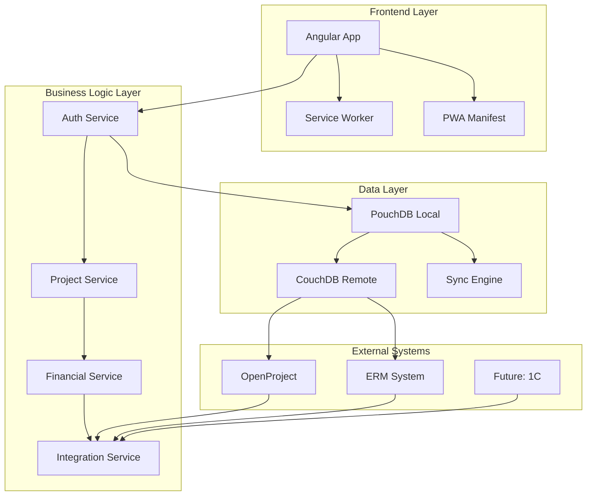

# Системная архитектура PWA приложения управления проектами

## Общая архитектура

### Архитектурный стиль
Приложение построено по принципу **многослойной архитектуры** с разделением на:
- **Presentation Layer** - Angular компоненты и сервисы
- **Business Logic Layer** - бизнес-логика и валидация
- **Data Access Layer** - работа с PouchDB и внешними API
- **Infrastructure Layer** - конфигурация, логирование, утилиты

### Технологический стек

```
┌─────────────────────────────────────────────────────────────┐
│                    Frontend (Angular 20)                   │
├─────────────────────────────────────────────────────────────┤
│  Components  │  Services  │  Guards  │  Interceptors      │
├─────────────────────────────────────────────────────────────┤
│                    PWA Infrastructure                       │
│  Service Worker  │  Manifest  │  Offline Support          │
├─────────────────────────────────────────────────────────────┤
│                    Data Layer                               │
│  PouchDB (Local)  │  CouchDB (Remote)  │  Sync Engine     │
├─────────────────────────────────────────────────────────────┤
│                    External Integrations                    │
│  OpenProject API  │  ERM API  │  Future: 1C API          │
└─────────────────────────────────────────────────────────────┘
```

## PWA архитектура

### Service Worker
- **Кэширование** критических ресурсов для офлайн работы
- **Фоновая синхронизация** данных при восстановлении соединения
- **Push уведомления** для важных событий
- **Стратегии кэширования**:
  - Cache First для статических ресурсов
  - Network First для API запросов
  - Stale While Revalidate для динамического контента

### Web App Manifest
```json
{
  "name": "Wone IT - Project Management",
  "short_name": "WonePM",
  "description": "Управление проектами и финансовая аналитика",
  "start_url": "/",
  "display": "standalone",
  "background_color": "#ffffff",
  "theme_color": "#3f51b5",
  "icons": [
    {
      "src": "assets/icons/icon-192x192.png",
      "sizes": "192x192",
      "type": "image/png"
    },
    {
      "src": "assets/icons/icon-512x512.png",
      "sizes": "512x512",
      "type": "image/png"
    }
  ]
}
```

## Архитектура базы данных

### PouchDB схема

#### Основные коллекции

**Users (Пользователи)**
```typescript
interface User {
  _id: string;
  _rev: string;
  type: 'user';
  email: string;
  password: string; // хешированный
  role: UserRole;
  firstName: string;
  lastName: string;
  middleName?: string;
  salary: {
    type: 'monthly' | 'hourly';
    amount: number;
    workingDaysPerMonth?: number; // для месячной оплаты
    hourlyRate?: number; // для почасовой оплаты
  };
  department: string;
  position: string;
  isActive: boolean;
  createdAt: Date;
  updatedAt: Date;
}
```

**Projects (Проекты)**
```typescript
interface Project {
  _id: string;
  _rev: string;
  type: 'project';
  name: string;
  description: string;
  department: string;
  status: ProjectStatus;
  lifecycle: {
    planning: {
      estimatedCost: number;
      estimatedHours: number;
      startDate: Date;
      endDate: Date;
    };
    contract: {
      contractCost: number;
      contractDate: Date;
    };
    execution: {
      actualStartDate: Date;
      actualEndDate?: Date;
      currentCost: number;
      completedHours: number;
    };
    billing: {
      invoices: string[]; // ID счетов
      totalInvoiced: number;
    };
    payment: {
      payments: string[]; // ID платежей
      totalReceived: number;
    };
  };
  participants: ProjectParticipant[];
  visibility: string[]; // ID пользователей с доступом
  createdAt: Date;
  updatedAt: Date;
}
```

**TimeEntries (Временные записи)**
```typescript
interface TimeEntry {
  _id: string;
  _rev: string;
  type: 'time_entry';
  projectId: string;
  userId: string;
  date: Date;
  hours: number;
  description: string;
  cost: number; // рассчитанная стоимость
  isApproved: boolean;
  approvedBy?: string;
  approvedAt?: Date;
  createdAt: Date;
  updatedAt: Date;
}
```

**Invoices (Счета)**
```typescript
interface Invoice {
  _id: string;
  _rev: string;
  type: 'invoice';
  projectId: string;
  number: string;
  amount: number;
  status: InvoiceStatus;
  issueDate: Date;
  dueDate: Date;
  paidDate?: Date;
  description: string;
  items: InvoiceItem[];
  createdAt: Date;
  updatedAt: Date;
}
```

**Payments (Платежи)**
```typescript
interface Payment {
  _id: string;
  _rev: string;
  type: 'payment';
  invoiceId: string;
  projectId: string;
  amount: number;
  date: Date;
  method: PaymentMethod;
  reference: string;
  description: string;
  createdAt: Date;
}
```

### Индексы и запросы

#### Mango индексы
```json
{
  "index": {
    "fields": ["type", "projectId", "date"]
  },
  "name": "time-entries-by-project-date",
  "type": "json"
}
```

```json
{
  "index": {
    "fields": ["type", "status", "dueDate"]
  },
  "name": "invoices-by-status-due",
  "type": "json"
}
```

#### Основные запросы
```typescript
// Получение проектов пользователя
const userProjects = await db.find({
  selector: {
    type: 'project',
    $or: [
      { 'participants.userId': userId },
      { visibility: userId }
    ]
  }
});

// Получение временных записей по проекту
const projectTimeEntries = await db.find({
  selector: {
    type: 'time_entry',
    projectId: projectId,
    date: { $gte: startDate, $lte: endDate }
  },
  sort: [{ date: 'desc' }]
});

// Расчет себестоимости проекта
const projectCost = await db.query('project-cost-calculation', {
  key: projectId,
  reduce: true
});
```

## Архитектура безопасности

### Аутентификация
- **JWT токены** для сессий
- **Refresh токены** для автоматического обновления
- **Хеширование паролей** с использованием bcrypt
- **Защита от брутфорса** с временными блокировками

### Авторизация
- **Role-Based Access Control (RBAC)** система
- **Guards** для защиты маршрутов
- **Interceptors** для проверки прав доступа
- **Аудит** всех действий пользователей

### Защита данных
- **Шифрование** чувствительных данных
- **Валидация** всех входных данных
- **Защита от XSS** и CSRF атак
- **HTTPS** для всех соединений

## Архитектура интеграций

### OpenProject интеграция
```typescript
interface OpenProjectIntegration {
  baseUrl: string;
  apiKey: string;
  syncInterval: number; // в минутах
  
  // Методы синхронизации
  syncProjects(): Promise<void>;
  syncTimeEntries(): Promise<void>;
  syncUsers(): Promise<void>;
  
  // Маппинг данных
  mapProject(openProjectData: any): Project;
  mapTimeEntry(openProjectData: any): TimeEntry;
}
```

### ERM интеграция
```typescript
interface ERMIntegration {
  baseUrl: string;
  credentials: ERMCredentials;
  syncInterval: number;
  
  // Синхронизация мастер-данных
  syncProjectMasterData(): Promise<void>;
  syncFinancialData(): Promise<void>;
  
  // Маппинг проектов
  mapProjectToERM(project: Project): ERMProject;
  mapProjectFromERM(ermProject: ERMProject): Project;
}
```

## Архитектура производительности

### Кэширование
- **Lazy Loading** модулей и компонентов
- **Virtual Scrolling** для больших списков
- **Debouncing** для поиска и фильтрации
- **Memoization** для тяжелых вычислений

### Оптимизация данных
- **Пагинация** для больших наборов данных
- **Ленивая загрузка** связанных сущностей
- **Индексы** для быстрого поиска
- **Кэширование** часто используемых запросов

### Мониторинг
- **Performance API** для отслеживания метрик
- **Error tracking** для мониторинга ошибок
- **Analytics** для анализа использования
- **Health checks** для проверки состояния системы

## Архитектура масштабирования

### Горизонтальное масштабирование
- **Stateless** архитектура для легкого масштабирования
- **Load balancing** для распределения нагрузки
- **Database sharding** для больших объемов данных
- **Microservices** архитектура для будущего развития

### Вертикальное масштабирование
- **Оптимизация** алгоритмов и структур данных
- **Кэширование** на всех уровнях
- **Асинхронная обработка** тяжелых операций
- **Балансировка** нагрузки между компонентами

## Диаграмма архитектуры



## Заключение

Архитектура системы спроектирована с учетом:
- **Масштабируемости** и производительности
- **Безопасности** и надежности
- **Гибкости** для будущих изменений
- **Стандартов** современной веб-разработки

Система готова к росту и развитию, поддерживает все требования технического задания и обеспечивает высокое качество пользовательского опыта.
