# Визуальные схемы и диаграммы системы

## 1. Общая архитектура системы

### Диаграмма компонентов высокого уровня

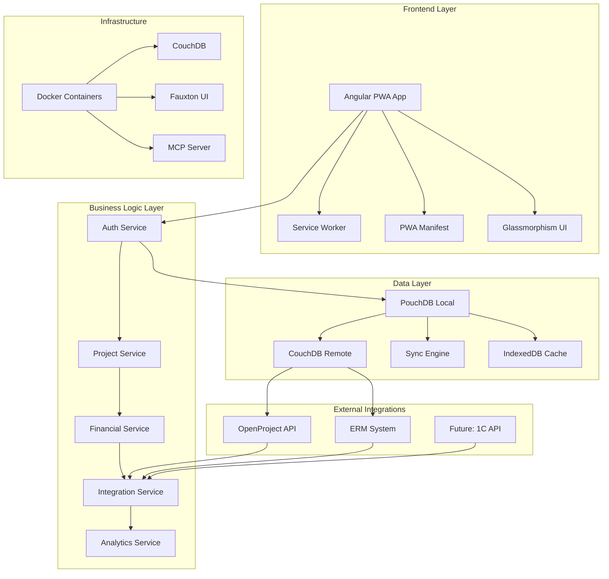

### Диаграмма потоков данных

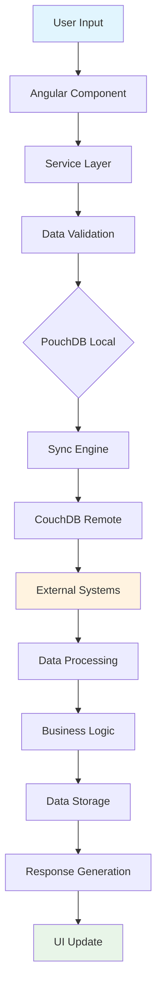

## 2. Жизненный цикл проекта

### Диаграмма состояний проекта

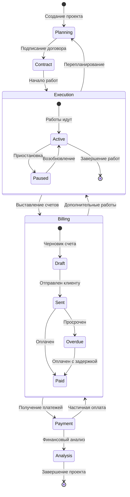

### Диаграмма финансового цикла

```mermaid
graph LR
    A[Планирование] --> B[Бюджет проекта]
    B --> C[Расчет стоимости]
    C --> D[Договор]
    D --> E[Выполнение работ]
    E --> F[Учет времени]
    F --> G[Расчет себестоимости]
    G --> H[Выставление счетов]
    H --> I[Получение платежей]
    I --> J[Финансовый анализ]
    J --> K[Расчет маржи]
    
    style A fill:#e3f2fd
    style D fill:#e8f5e8
    style H fill:#fff3e0
    style K fill:#fce4ec
```

## 3. Структура базы данных

### ER-диаграмма основных сущностей

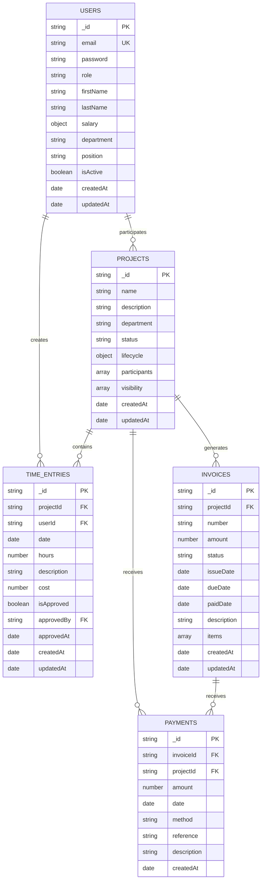

### Диаграмма индексов и запросов

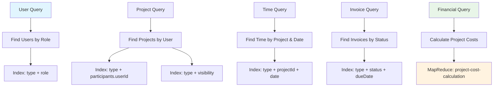

## 4. Система ролей и прав доступа

### Диаграмма иерархии ролей

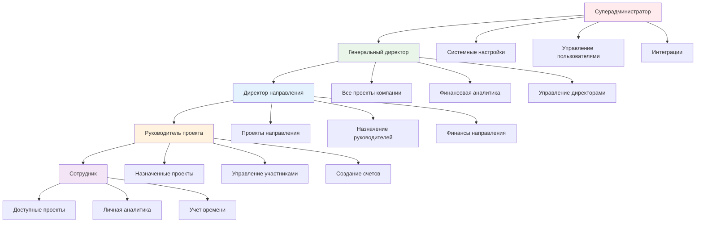

### Диаграмма матрицы прав доступа

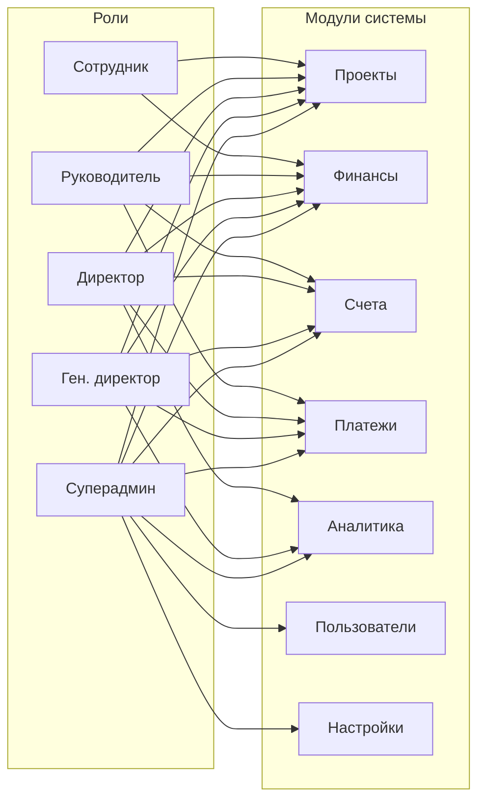

## 5. Интеграции с внешними системами

### Диаграмма интеграции OpenProject

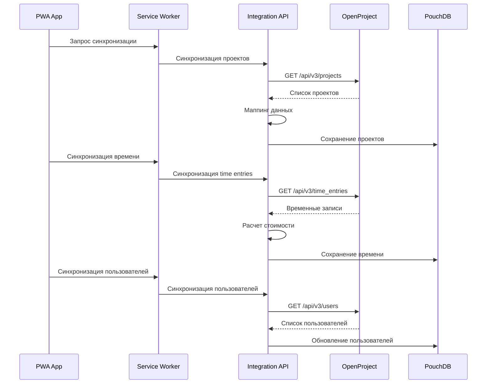

### Диаграмма интеграции ERM

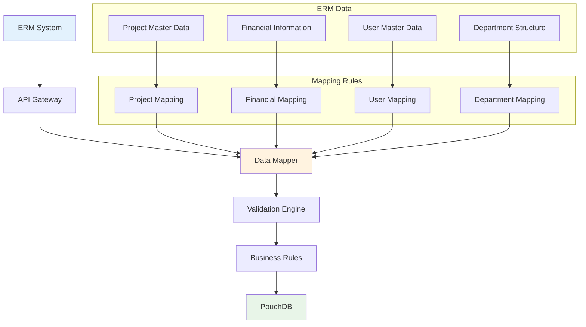

## 6. PWA архитектура

### Диаграмма Service Worker

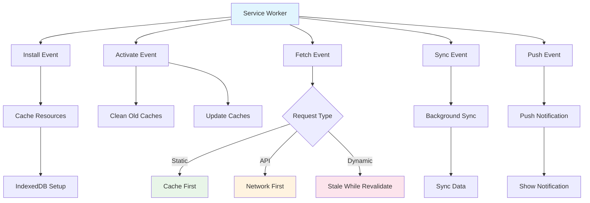

### Диаграмма стратегий кэширования

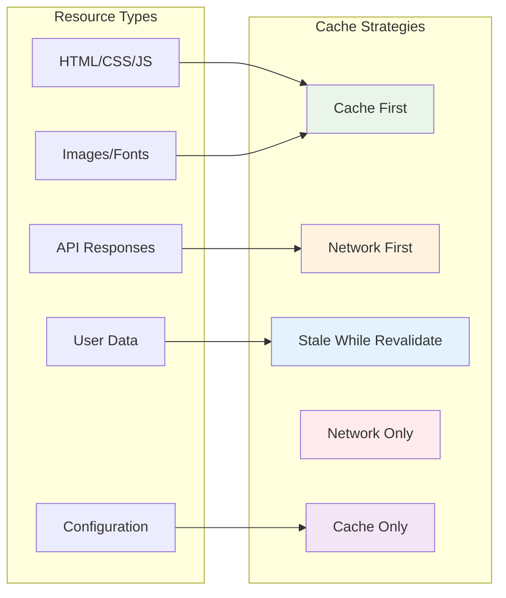

## 7. Финансовые алгоритмы

### Диаграмма расчета себестоимости

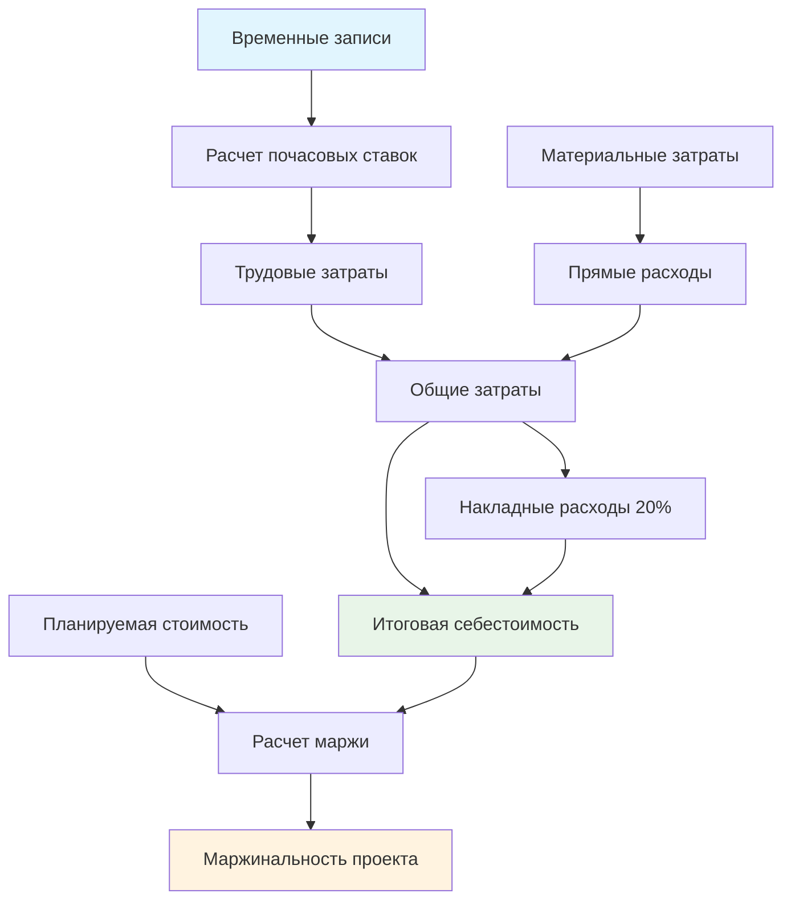

### Диаграмма анализа ROI

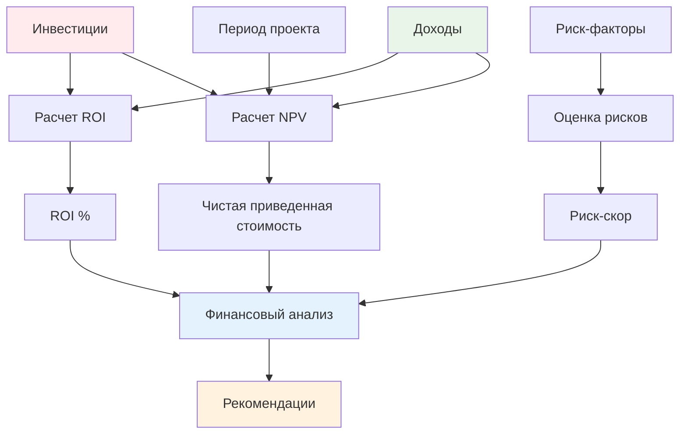

## 8. Пользовательские интерфейсы

### Диаграмма структуры компонентов

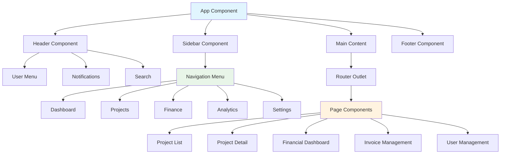

### Диаграмма навигации

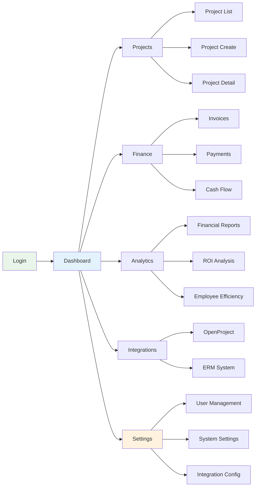

## 9. Процессы синхронизации

### Диаграмма синхронизации данных

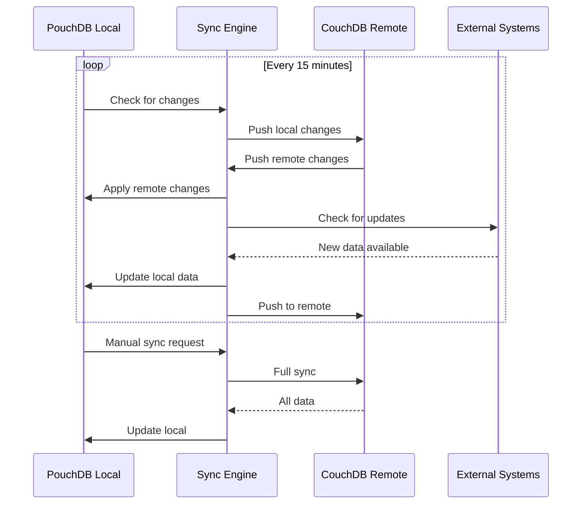

### Диаграмма обработки конфликтов

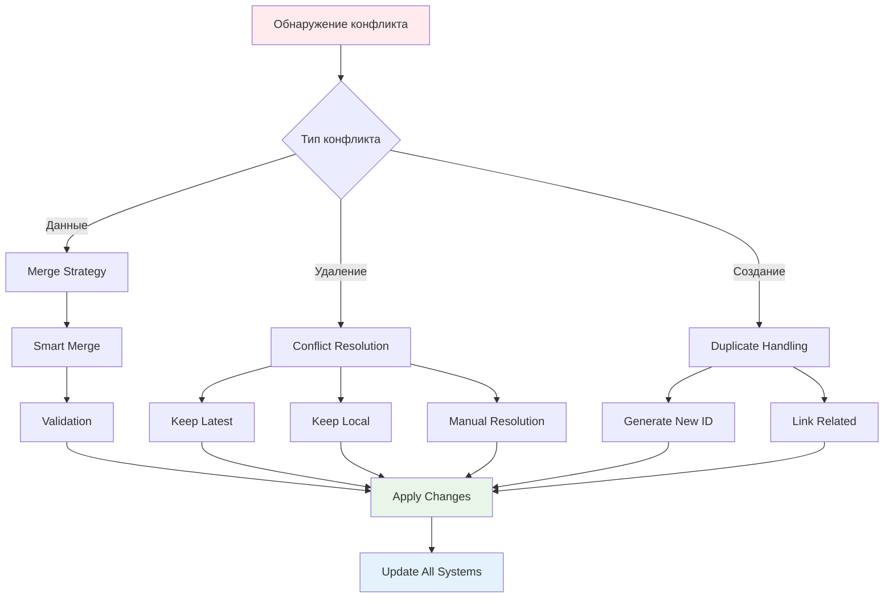

## 10. Мониторинг и аналитика

### Диаграмма метрик производительности

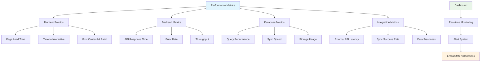

### Диаграмма системы логирования

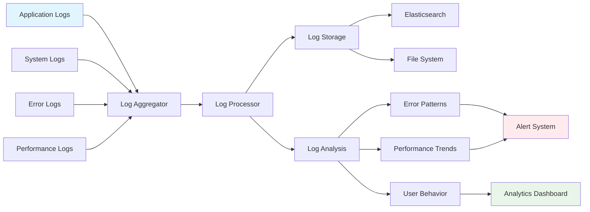

## Заключение

Представленные диаграммы и схемы обеспечивают:

1. **Визуальное понимание** архитектуры системы
2. **Документирование** процессов и потоков данных
3. **Планирование** разработки и тестирования
4. **Обучение** новых разработчиков
5. **Анализ** производительности и оптимизации

Все диаграммы созданы с использованием Mermaid.js и могут быть легко обновлены при изменении системы.
